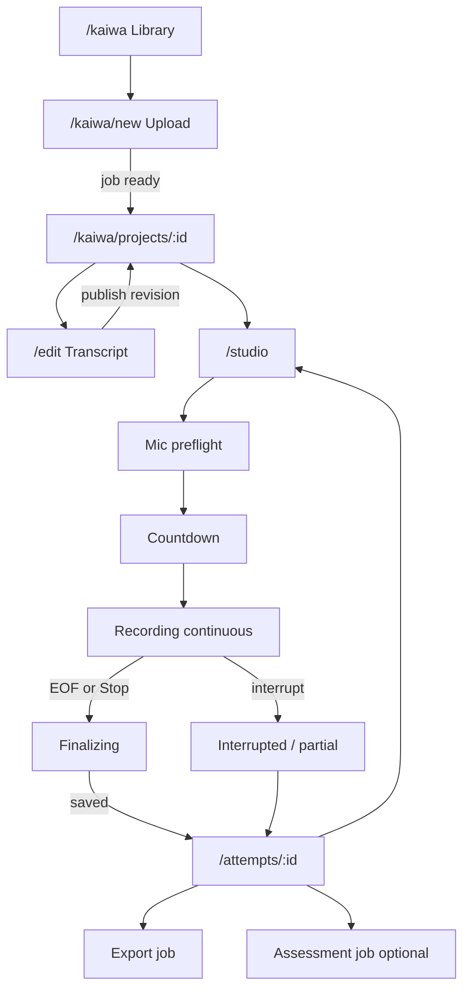

# KAI-004 — Kaiwa UX specification

Date: 2026-09-17
Status: DONE (spec only — **no production UI implementation in this task**)
Depends: KAI-001, KAI-002 (ADR-016 recorder clock/states)
Align: PLAN §4, §8.2; DESIGN.md; UX-CONTRACT.md; ADR-011 (no role-play yet)

## 1. Non‑negotiables

- **No** mandatory character / role selection in Gate A/B flows.
- **No** auto-stop recording after each subtitle sentence; continuous take until user stop or EOF/interrupt.
- Furigana default **on**, romaji default **off**, Vietnamese translation independent.
- Assessment status never blocks playback/export messaging (ADR-014).
- Reuse Kotoba shell (sidebar, topbar, ErrorState, focus ≥44px, Vietnamese UI).

## 2. Information architecture & routes

| Route | Primary job | Key actions |
|-------|-------------|-------------|
| `/kaiwa` | Private library | Search; open project; New |
| `/kaiwa/new` | Upload | Pick file; progress; cancel/retry |
| `/kaiwa/projects/:id` | Project hub | Prep status; start practice; open edit |
| `/kaiwa/projects/:id/edit` | Transcript editor | SRT/VTT/manual; timings; JA/reading/VI |
| `/kaiwa/projects/:id/studio` | Continuous studio | Preflight → countdown → record → finalize |
| `/kaiwa/attempts/:id` | Review take | Mix gains; A/B segment; export; re-practice |
| `/kaiwa/history` | History | By day/video; speaking time; assessment status |

Nav: one sidebar item **Kaiwa** → `/kaiwa` (place after Grammar). Title via `startsWith('/kaiwa')`.

## 3. End‑to‑end wireflow

## 4. Recorder state machine (UI)

Align ADR-016 / PLAN §8.2. **Three axes** (do not collapse into one boolean):

| Axis | States |
|------|--------|
| Capture | `idle → preparing → ready → countdown → recording → finalizing → saved` (+ `permission_denied`, `interrupted`, `failed`, `discarded`) |
| Upload | `idle → buffering → uploading → upload_pending → server_acked → failed` |
| Media process | `none → queued → running → ready → failed` |

### UI rules while `recording`

- Lock seek and playback rate (force 1×).
- Large recording indicator + primary **Kết thúc** (≥44px).
- Do **not** auto-scroll chrome over video.
- Current + next subtitle may show; advancing lines must not stop capture.
- On early stop: save as **chưa hoàn tất** if data valid — never “đã lồng tiếng xong toàn video”.

### Data-loss / honesty copy (Vietnamese)

| Situation | Message (canonical) |
|-----------|---------------------|
| Tab closed before server ack | “Phần đã gửi lên máy chủ vẫn giữ được. Phần chỉ còn trên máy này có thể mất.” |
| Buffer full | “Bộ nhớ tạm trên máy đã đầy. Đã dừng thu an toàn. Hãy thử lại khi còn dung lượng.” |
| Mic lost mid-take | “Mất micro — đã dừng thu. Bản ghi dở được lưu nếu đủ dữ liệu.” |
| Chunk not decodable after crash | “Không khôi phục được đoạn chưa ghép xong. Không báo đã lưu giả.” |
| Offline with safe buffer | “Đang ngoại tuyến — tiếp tục thu trong giới hạn bộ đệm. Chưa đồng bộ máy chủ.” |
| Assessment failed | “Chưa chấm được (lý do). Bạn vẫn nghe lại và xuất video bình thường.” |

## 5. Screen specs (desktop + mobile)

### 5.1 Library `/kaiwa`

- **Empty:** illustration + “Tải video đầu tiên” CTA.
- **Loading:** skeleton cards.
- **Error:** ErrorState + retry.
- Cards: title, duration, last practice, processing badge.
- Keyboard: Tab through cards; Enter opens; `/` focuses search if present.

### 5.2 Upload `/kaiwa/new`

- Dropzone + file picker; show pilot limits (10 phút / 250 MB — ADR-015).
- Progress determinate; Cancel; Retry on failure.
- Reject with distinct copy: unsupported vs corrupt vs too long (KAI-009).
- Mobile: full-width primary button; keep limits visible above fold.

### 5.3 Edit `/projects/:id/edit`

- Video scrubber synced to segment list.
- Click segment → seek (prep only; not during record).
- Toggle chips: Furigana / Romaji / VI (account-persisted prefs).
- Publish revision CTA with concurrency conflict toast.
- No role picker.

### 5.4 Studio `/projects/:id/studio`

Layout desktop: video dominant left/top; script panel secondary; transport + mic meter sticky.
Mobile: video top; script below; transport sticky bottom ≥44px.

Steps: Preflight (permission, device select, meter, short test — **no loudspeaker loopback**) → Countdown → Record → Finalize spinner → redirect review.

### 5.5 Review `/attempts/:id`

- Dual gain: original vs learner (no fake “music only” if single muxed track).
- Segment list with assessment badges (`ready` / `unavailable` / …).
- Export button independent of assessment.
- Keyboard: Space play/pause when not in input; `E` focus export (document in help).

### 5.6 History `/kaiwa/history`

- List by local day `Asia/Ho_Chi_Minh`.
- Show speaking duration (exclude upload/wait/silence per PLAN §11.1).

## 6. Loading / empty / error / offline matrix

| Surface | Loading | Empty | Error | Offline |
|---------|---------|-------|-------|---------|
| Library | Skeletons | CTA upload | Retry | Read cache if any; else explain |
| Upload | Progress | — | Retry/cancel | Disable complete; keep local pick info |
| Edit | Spinner | “Chưa có lời thoại — thêm thủ công” | Retry save | Allow local draft warn unsynced |
| Studio | Preparing | — | Preflight errors | Record only if buffer policy allows |
| Review | Spinner | — | Playback error | Play server-acked media only |
| Export | Job progress | — | Retry export | Queue message |

## 7. Browser / device matrix (claims)

| Combo | View/learn | Record claim | Notes |
|-------|------------|--------------|-------|
| Desktop Chrome (Win/macOS) | Yes | **Gate A target** | KAI-002 lab PASS synthetic |
| Desktop Edge | Yes | **Gate A target** | Chromium; verify once on real mic |
| Desktop Firefox | Yes | **Unclaimed** until tested | |
| Safari macOS | Yes | **Unclaimed** | |
| Mobile Chrome/Safari | UI required | **Unclaimed** | Explain before getUserMedia if unsupported |
| iOS background audio | — | High risk | Interrupt → safe stop |

Update this table only with real evidence (KAI-033 device QA).

## 8. Accessibility

- Visible focus; skip link works inside Kaiwa pages.
- Recording state announced (`aria-live="assertive"`).
- Meter not color-only; text dB/level.
- Ruby/furigana must not overflow mobile width (wrap / scroll segment).
- All critical results have text, not chart-only (PLAN §4.3).

## 9. Out of scope for this spec

- Character role-play UI (KAI-035 / Gate C).
- Implementing React pages (starts with KAI-011+ / studio tasks).
- Final visual polish beyond DESIGN tokens.

## 10. Acceptance trace

| Criterion | Where |
|-----------|--------|
| Desktop/mobile wireflow | §§3–5 |
| Keyboard | §§5.1, 5.5, 8 |
| Loading/empty/error/offline | §6 |
| Data-loss messaging | §4 table |
| No role select | §§1, 5.3 |
| No per-sentence stop (**continuous** mode) | §§1, 4 |

---

## 11. Addendum — Segment studio default (ADR-019 / KAI-036)

Date: 2026-09-18

**Supersedes** the “list-only script under video is enough” implication for Gate A speakability.

- **Default capture mode:** per-segment practice with **on-video script overlay** (see `docs/kaiwa/evidence/kai-036/SEGMENT-STUDIO-SPEC.md`).
- **Continuous mode:** remains advanced; must show live current+next overlay (KAI-041), still no auto-stop per sentence.
- Studio §5.4 layout: overlay is primary; segment list is secondary status chrome.
- Gate A ACCEPTED requires segment-mode device PASS (KAI-046), not continuous-only.
