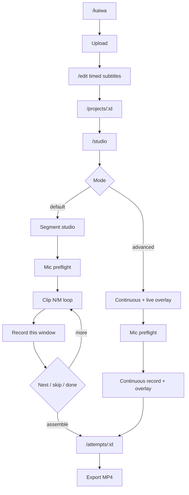

# KAI-036 — Segment studio UX specification (ADR-019)

Date: 2026-09-18  
Status: DONE (spec)  
Depends: ADR-019, KAI-004  
Implementation: KAI-037–047  
Reference UX: Dub Stage style (line N/M, script overlay, replay original / record / replay take / next) — **not** character role-play (Gate C).

## 1. Problem (device feedback)

Continuous studio shows mic + video + “Bắt đầu thu liên tục”, while the timed script sits in a long list **below** the player. Learners cannot look at the cue and speak at the same time. Gate A is not “usable speaking practice” until the active line is visible on/near the video.

## 2. Product rules

| Rule | Detail |
|------|--------|
| Default mode | `segment` (theo đoạn) |
| Advanced mode | `continuous` (liên tục) — still offered |
| Gate A ACCEPTED | Requires **segment** device PASS (KAI-046). Continuous-only is insufficient |
| Honesty | Assembled multi-clip audio must set `capture_mode=segment` (or `segment_assembled`). Never market as continuous take |
| No role pick | Still no character selection |
| Scoring | Does not block speak / listen / export |

## 3. End-to-end wireflow (segment default)



## 4. Segment studio layout

### 4.1 Desktop

- **Video dominant** with **semi-transparent script overlay** at bottom of frame (JA primary; furigana/VI/romaji per account toggles).
- Badge: `Đoạn N / M` (and optional “đã thu X”).
- Below video: transport for **this clip only**:
  - Nghe mẫu đoạn (replay original in `[startMs, endMs]`)
  - Thu / Thu lại
  - Nghe giọng mình (if clip exists)
  - Trước · Tiếp · Bỏ qua
- Mic meter from existing preflight patterns (≥44px targets).
- Side or below: compact list of segments with status chips (`chưa` / `đã thu` / `bỏ qua`) — secondary; **overlay is primary**.

### 4.2 Mobile

- Video top + overlay; sticky bottom control bar; ruby must wrap / not overflow (same as KAI-014 rules).

### 4.3 Overlay content

While clip `i` is active:

1. Japanese text for segment `i` (required).
2. Furigana if toggle on.
3. VI / romaji if toggles on.
4. Optional small next-line peek (dimmed) — must not steal focus from current line.
5. Timecode of window: `mm:ss.mmm → mm:ss.mmm`.

Overlay must remain readable during countdown and recording (contrast ≥ existing Status/panel patterns; no emoji stickers).

## 5. Clip loop behaviour

| Action | Behaviour |
|--------|-----------|
| Enter clip | Seek video to `startMs`; pause; show overlay; enable Nghe mẫu |
| Nghe mẫu đoạn | Play source `[startMs, endMs]` at 1× (prep may allow slower **before** Record starts — PLAN); stop at `endMs` |
| Thu | Countdown 3-2-1 optional short; record mic only for window length (or until user stops early → partial clip); video plays in sync for the window |
| Thu lại | New clip version; previous kept per KAI-042 |
| Nghe mình | Play learner clip for this segment only |
| Tiếp | Save status; go to next non-skipped pending (or end) |
| Trước | Go to previous segment |
| Bỏ qua | Mark `skipped` with reason optional; does not invent speech |
| Kết thúc phiên | May assemble incomplete set → attempt `partial` / incomplete coverage honest |

### Recording constraints (segment)

- Playback rate while recording clip = **1×**.
- Seek outside window disabled while `recording_clip`.
- Do not auto-advance to next clip mid-record.
- Earphones recommended (existing preflight copy).

## 6. Large scripts (90+ lines)

- Progress: `Đã thu A / M` + optional subset filter (“còn thiếu”, “chỉ đánh dấu luyện”).
- **Skip** and **subset practice** required (KAI-043) — do not force finishing all lines in one sitting.
- Resume: reopen studio → land on first `pending` clip.

## 7. Continuous mode (advanced) — overlay required

Even in continuous mode:

- Show **current + next** subtitle overlay synced to video clock.
- Do **not** auto-stop per sentence (ADR-011 continuous semantics).
- List below video is optional secondary.

Spec detail for implementation: KAI-041.

## 8. Mode picker copy (VI)

- Default selected: **Theo đoạn — dễ nói theo lời (khuyến nghị)**.
- Secondary: **Liên tục — thu cả video một lần (nâng cao)**.
- Helper: “Bản ghép từ từng đoạn không được gọi là thu liên tục.”

Persist preference on account (localStorage or user prefs — implementer choice; document in KAI-040).

## 9. Data contracts (for KAI-037+)

Conceptual (not schema DDL here):

```ts
type CaptureMode = "segment" | "continuous";

type SegmentClipStatus = "pending" | "recorded" | "skipped" | "partial";

// attempt.device_json / clocks_json additions
{
  captureMode: CaptureMode;
  assembly?: "none" | "segment_timeline";
  segmentProgress?: { recorded: number; skipped: number; total: number };
}
```

Clips: one audio asset (or journal) per `(attemptId, segmentId, version)`.

## 10. Vietnamese UI strings (canonical)

| Situation | Copy |
|-----------|------|
| Empty transcript | “Chưa có lời thoại theo thời gian — hãy soạn phụ đề trước khi thu theo đoạn.” |
| Recording clip | “Đang thu đoạn N/M — nhìn lời trên video.” |
| Skipped | “Đã bỏ qua đoạn này — không tính là đã nói.” |
| Assemble partial | “Chưa thu đủ mọi đoạn. Bản nghe/xuất chỉ gồm phần đã thu.” |
| Continuous chosen | “Chế độ nâng cao: vẫn hiện lời hiện tại trên video; không dừng từng câu.” |
| Assessment fail | Keep ADR-014: vẫn nghe/xuất được. |

## 11. Acceptance (this task)

- [x] Spec covers overlay, clip controls, skip/subset, N/M, VI copy
- [x] Continuous overlay requirement documented
- [x] No role selection
- [x] UX-SPEC / USAGE / CHECKLIST updated to point here
- [x] Evidence folder `docs/kaiwa/evidence/kai-036/`

## 12. Out of scope here

- Implementing React/recorder (KAI-038+)
- Role-play / multi-speaker (KAI-035)
- Live pronunciation scores
