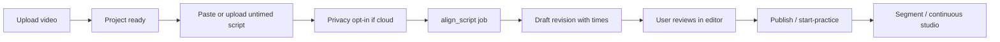

# Auto subtitle — product & technical spec (ADR-020 / KAI-050)

Date: 2026-09-18  
Status: **SPEC ONLY** — no implementation yet. Implementation = KAI-051+ after this task DONE.

Related: ADR-012 (revisions), ADR-014 (honesty), ADR-015 (privacy), ADR-020, KAI-013 (manual), KAI-015 (stub).

---

## 1. Problem

Gate A already supports **manual timed** subtitles (SRT/VTT / editor). That is enough to speak, but preparing `startMs`/`endMs` for every line is slow.

User ask:

| Version | Input | Output |
| --- | --- | --- |
| **v1.0 Script sync** | Video + **untimed** dialogue text (plain text OK; not required to be SRT/VTT) | Timed `segments[]` aligned to speech in the video |
| **v2.0 Auto transcript** | Video only | Timed subtitles generated by ASR (text + times) |

Both outputs must be **editable drafts** before practice (same editor / publish / start-practice as today).

---

## 2. What already exists (repo facts)

| Piece | State |
| --- | --- |
| Transcript editor + SRT/VTT parse | DONE (KAI-013) |
| Draft / publish / immutable revision | DONE (ADR-012) |
| Segment studio needs timed segments | DONE (KAI-036+) |
| `POST …/transcriptions` | Stub → `503 speech_not_configured` (KAI-015) |
| ffmpeg path for export | Optional (`FFMPEG_PATH`) |
| Live ASR / forced-align credentials | **Not configured** (KAI-003 / KAI-015) |

Manual path must keep working when auto jobs fail.

---

## 3. Product wireflow

### 3.1 v1.0 — Script sync



### 3.2 v2.0 — Auto transcript

Same as v1 but **Script** step is replaced by **“Tự tạo phụ đề từ video”** → `transcribe` job → draft.

### 3.3 Vietnamese UI copy (canonical)

| Situation | Copy |
| --- | --- |
| v1 CTA | “Đồng bộ lời thoại với video (tự gán thời gian)” |
| v2 CTA | “Tự tạo phụ đề từ video (ASR)” |
| Draft banner | “Bản nháp máy tạo — hãy kiểm tra mốc thời gian trước khi luyện.” |
| Uncertain segment | “Đoạn này khớp chưa chắc — nên sửa tay.” |
| No provider | “Chưa cấu hình tự động. Hãy nhập SRT/VTT hoặc soạn tay.” |
| Opt-in | “Audio sẽ gửi tới nhà cung cấp X để căn thời gian. Không gửi nếu bạn tắt.” |

---

## 4. Inputs (v1)

Accepted **untimed** script forms (minimum for v1):

1. **Paste box** — lines / blank-line paragraphs → one segment candidate per non-empty line (or sentence split for long lines).
2. **`.txt` / `.md` upload** — UTF-8, same split rules.
3. **SRT/VTT with missing/zero times** — keep text cues; ignore bogus times; re-time via aligner.

Out of v1 scope (may defer): OCR hardsubs, bilingual columns auto-detect, PDF.

Normalization:

- Strip HTML/`script` (reuse subtitle sanitizer).
- Preserve Japanese text; do not “fix” kana/kanji.
- Optional: user chooses JA vs VI as align language (default JA for Kaiwa).

---

## 5. Technical approach

### 5.1 Shared pipeline pieces

1. **Extract mono WAV/PCM** from project source/proxy via ffmpeg (required for reliable align; if no ffmpeg → clear error, fall back to manual).
2. **Durable job** (`kaiwa_jobs`): `align_script` (v1), `transcribe` (v2) — same lease/retry pattern as export.
3. **Write draft only** into `kaiwa_revisions` / draft payload with metadata:

```ts
{
  source: "script_align" | "asr" | "manual" | "import_srt";
  alignEngine?: string;
  alignConfidence?: number | null;
  provider?: string;
  generatedAt: string;
  segments: Array<{
    id: string;
    startMs: number;
    endMs: number;
    ja: string;
    vi?: string;
    timingUncertain?: boolean;
  }>;
}
```

4. Conflict: if draft `expectedRevisionVersion` stale → 409; never clobber newer user edits.

### 5.2 v1 alignment strategies (spike must pick one)

| Candidate | Idea | Pros | Cons |
| --- | --- | --- | --- |
| **A. Whisper (word timestamps) + text match** | ASR words + DTW/Needleman vs known script | Strong ecosystem; JA OK | Needs GPU/API; may rewrite words — **must prefer script text**, only take times |
| **B. Forced aligner (e.g. MFA / aeneas-like)** | Known text forced onto audio | Text stays exact | JA model setup heavy; quality varies |
| **C. Cloud STT with phrase hint / display form** | Azure/Google with reference text | Managed | Cost; privacy; field verify required |

**Product rule:** In v1 the **displayed Japanese text is the user’s script**, not the ASR hypothesis. Engine may only supply **boundaries**. If align fails for a line → mark `timingUncertain` and leave rough placeholder times or skip that line for user fix — **do not invent dialogue**.

### 5.3 v2 transcription

- Full ASR → segment by silence / punctuation / max length.
- Same draft review.
- Higher false-text risk → stronger UI warning.

### 5.4 Quality gates

- Reject empty script / empty audio.
- Cap duration to pilot limits (ADR-015).
- Soft-fail: partial results OK if ≥N% lines timed; UI lists failures.
- Never auto-start practice without user open of editor (or explicit “Tôi đã kiểm tra”).

---

## 6. API (additive)

| Method | Path | Role |
| --- | --- | --- |
| `POST` | `/projects/:id/script-align` | Body: `{ text }` or asset id of `.txt`; enqueues `align_script` |
| `POST` | `/projects/:id/transcriptions` | **Wire live** (today 503); v2 ASR |
| `GET` | `/jobs/:id` | Progress (existing) |
| `GET` | `/projects/:id/draft` | Includes `source` / uncertain flags |

Capability surface (`/speech/capability`) must expose:

- `scriptAlign.status`: `not_configured | ready | degraded`
- `transcription.status`: same

---

## 7. UI surfaces

| Screen | Change |
| --- | --- |
| Project / edit transcript | Tabs or actions: Soạn tay · Nhập SRT · **Đồng bộ script (v1)** · **Tự tạo từ video (v2)** |
| Job progress | Poll job; cancel; show partial |
| Editor | Banner draft source; chips for uncertain rows; seek still works |
| Prep | Unchanged once published |

---

## 8. Risks & mitigations

| Risk | Mitigation |
| --- | --- |
| Music / multi-speaker / overlap | Uncertain flags; user edit; document limits |
| JA forced-align quality | Spike on real anime/drama fixtures (short, legal) |
| Cost / quota | Per-user job limits; ADR-015 budget |
| Privacy | Opt-in modal; local-only path if we ship on-device Whisper later |
| Scope creep into scoring | Keep separate from KAI-023 Gate B |

---

## 9. Milestone acceptance

### v1.0 DONE when

- [x] Untimed script → draft timed segments on a real short JA video (spike evidence)
- [x] User can fix times in editor and start segment studio
- [x] Manual path still works with `not_configured`
- [x] Tests: parse script, job idempotency, no overwrite newer draft, ownership
- [x] USAGE documents honesty + opt-in

### v2.0 DONE when

- [ ] Video-only ASR draft path
- [ ] Same review/publish guarantees
- [ ] Capability UI honest without keys

---

## 10. Suggested task order

See `docs/kaiwa/TASKS.md` §9 (KAI-050–058).

**Critical path v1:** KAI-050 (this spec) → 051 ingest → 052 spike → 053 job → 054 UI → 055 honesty QA.

**v2:** 056 live ASR → 057 UI → 058 docs.
