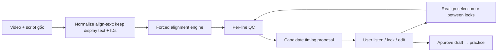

# Forced-align v1 redesign — product/tech spec (KAI-065+)

Date: 2026-09-18  
Status: Approved direction (ADR-021). Implementation phased in TASKS §9c.  
Related: ADR-020 (auto subtitle), Gate A ACCEPTED (speakable path independent).

## 1. Goal

Replace Whisper-greedy script sync with **forced alignment**: keep user script text/order; find speech windows in audio; never cascade one bad match into the rest of the file; never invent “success” timings for unmatched lines.

## 2. Known defects in current v1 (must regress)

| ID | Defect | Evidence |
| --- | --- | --- |
| D1 | Greedy forward match + no Kanji/kana equivalence → first line can swallow later audio | Synthetic unit case (KAI-065) |
| D2 | End-stretch to next start without silence check → short line becomes tens of seconds; may stay `timingUncertain=false` | Synthetic unit case (KAI-065) |
| D3 | Backend `null` → `startMs=0` + placeholder slot | `scriptAlign.ts` pre-KAI-065 |
| D4 | Align rebuilds segments from `ja` only → drops id/vi/tokens | `scriptAlign.ts` |
| D5 | Spike GT = TTS file duration; spike algo ≠ production sidecar | `spike_script_align.py` |

## 3. Target architecture

### Display vs align text

- **Display `ja`:** user original.
- **Align text:** whitespace/Unicode/punctuation normalized for engine; optional reading variants mapped back — never discard reverse map; **no LLM rewrite**.

### Speech vs practice windows

| Field | Meaning |
| --- | --- |
| `speechStartMs` / `speechEndMs` (or start/end while migrating) | Actual spoken span |
| Practice lead-in / trail | Studio config only |
| Overlay early show | UI only |

Do **not** write practice padding into transcript end times.

### Per-line status

| `timingStatus` | Behavior |
| --- | --- |
| `proposed` | Draft timing; user should still spot-check |
| `needs_review` | Show reason (weak match, unstable, long gap, etc.) |
| `unmatched` | Keep text; **no** fake 0–N s window presented as aligned; filter out of speakable auto-windows |

## 4. Engine bake-off order

1. Qwen3-ForcedAligner-0.6B  
2. stable-ts direct align  
3. WhisperX JA CTC (contrast)  
4. MFA Japanese (reserve)

Same fixtures + scripts; measure median/P95 boundary error, cascade failures, user-fix minutes, CPU latency/RAM. Anime/BGM reported separately — never averaged away.

## 5. Benchmark (Phase 2)

- Target: ≥30 clips / ~300 lines; legal fixtures; personal media **outside** git.
- Ground truth: human + waveform, not TTS file length.
- Acceptance targets (discussion — not yet achieved): see ADR-021 / TASKS KAI-066.

## 6. Editor (Phase 5)

Listen with context, waveform drag, lock line, realign selection, realign between locks, filter unmatched/needs_review, preview+undo.

## 7. Out of scope this milestone

- v2 ASR quality push  
- Gate B pronunciation  
- Claiming anime “clean” separation  
- Committing user media
